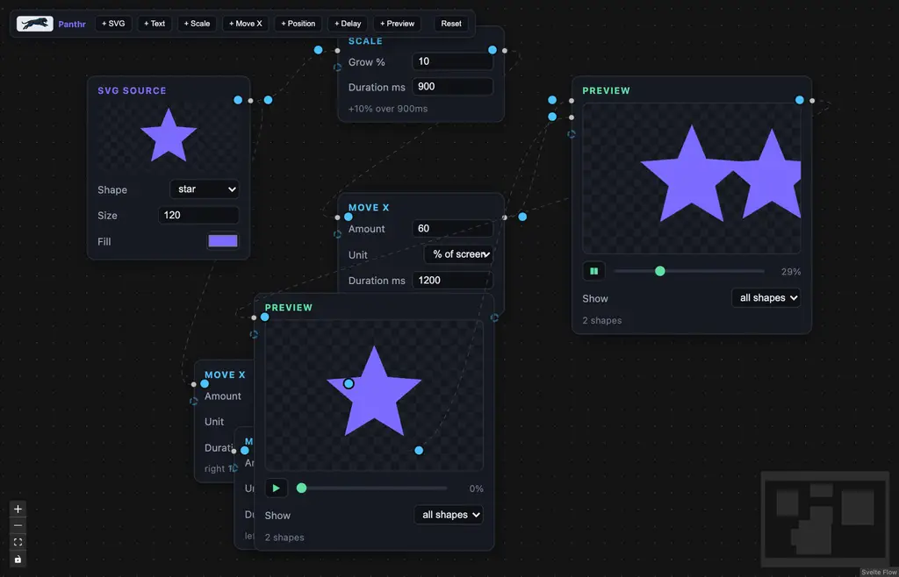

<p align="center">
  
</p>

<h1 align="center">Panthr</h1>

<p align="center">
  Node-based motion graphics in the browser. Wire shapes through transform nodes and watch them move.
</p>



## What it is

Panthr is a visual, node-based animation editor built with [Svelte Flow](https://svelteflow.dev).
Sources emit graphics, transform nodes animate them, and preview nodes play the result —
all composed on an infinite canvas with per-wire routing.

## Nodes

| Node | What it does |
| --- | --- |
| **SVG Source** | Defines a graphic: preset shapes (rect, circle, triangle, star, heart) or raw custom SVG markup, with size and fill. |
| **Text** | Defines a text graphic with content, font size, and fill. |
| **Scale** | Grows/shrinks by a percentage over a duration. |
| **Move X** | Translates left/right by px or % of screen over a duration. |
| **Delay** | Holds the current pose for a duration between moves. |
| **Position** | Places graphics on the stage — drag the pad or enter X/Y (px or % of stage). Merges all inputs into one positioned group output. |
| **Preview** | Renders everything reaching it on a stage, with a play/pause button and a 0–100% scrubber. Has an output so previews can feed other previews and combine. |

## The wiring model

- **Self-aware handles**: every node always shows one free (dashed) input handle — connect to it and another opens below. Transform outputs mirror occupied inputs (`in-i` feeds `out-i`), so each shape keeps its own wire through a chain.
- **No-op connections rejected**: duplicate wires, self-loops, and cycles never connect.
- **Rewiring**: drag an edge's end dot onto another handle to re-attach, or drop it on empty canvas to detach. Select + `Backspace` deletes nodes and edges.
- **Tracks**: wires carry graphics with accumulated animation steps (scales multiply, translations add) and static position offsets. Animations play once and hold — scrub or replay from the preview's transport.

## Persistence

The board auto-saves to `localStorage` (debounced) and restores on reload.
**Reset** in the toolbar restores the default starting board.

## Develop

```bash
bun install
bun dev        # http://localhost:5173
```

```bash
bun run build  # production build
bun run check  # svelte-check + tsc
```

## Stack

- [Svelte 5](https://svelte.dev) (runes) + [Vite](https://vite.dev) + TypeScript
- [@xyflow/svelte](https://svelteflow.dev) for the node canvas
- [Web Animations API](https://developer.mozilla.org/en-US/docs/Web/API/Web_Animations_API) for playback and scrubbing
